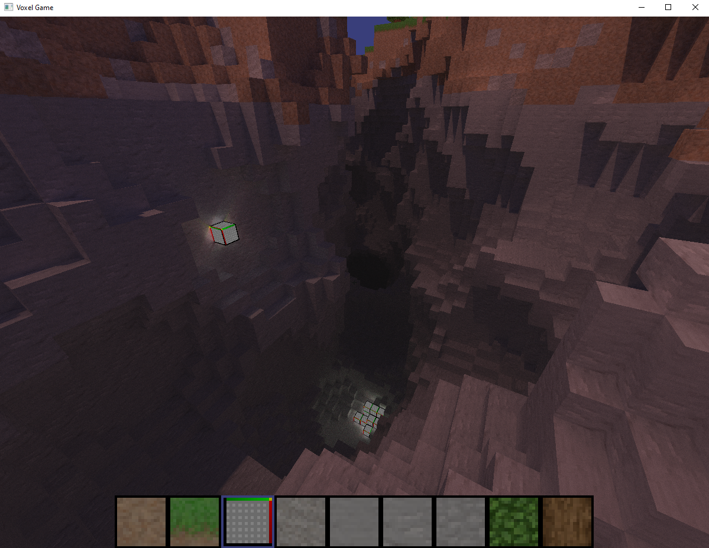

# Learn OpenGL

This is a repository in which I intend to learn how to use OpenGL by experimenting with different concepts.

# Samples

Currently, the most interesting concept I've created (at least in my opinion) is the raytraced voxel "game"
[Here](https://www.youtube.com/watch?v=X5LSPRKCUgk) is a short clip showing a cool bug I encountered while creating this



## Building

Dependencies:
- A C++ Compiler (MSVC, Clang, GCC)
- CMake
- Installed the following packages with vcpkg (in no particular order)
    - glm
    - glad[extensions]
    - glfw
    - assimp
    - freetype
    - stb
    - fmt

```py
# create build dir
mkdir build
cd build
# configure cmake to release mode
cmake .. -DCMAKE_BUILD_TYPE=Release -DCMAKE_TOOLCHAIN_FILE=[path to vcpkg root]/scripts/buildsystems/vcpkg.cmake

# build all
cmake --build . -S ../ -B . 
# optionally, instead you can build just a single target:
cmake --build . -S ../ -B . --target raytraced_voxels

# back out of the build directory
cd ..
# run a target
./build/voxel_game/raytraced/Release/raytraced_voxels.exe
```
